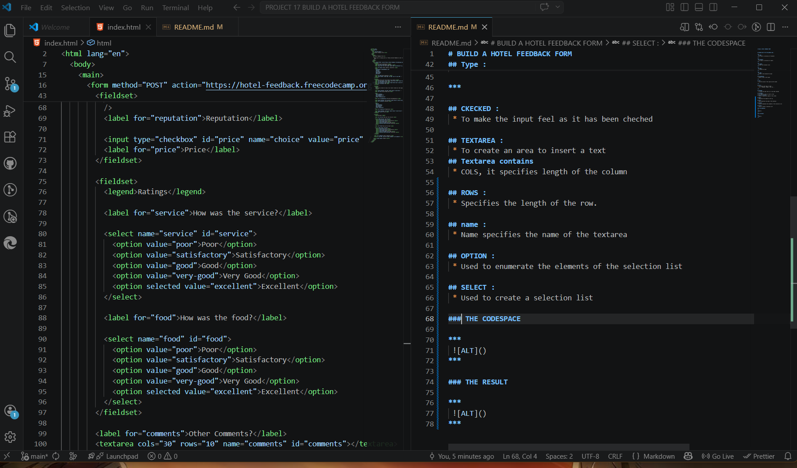
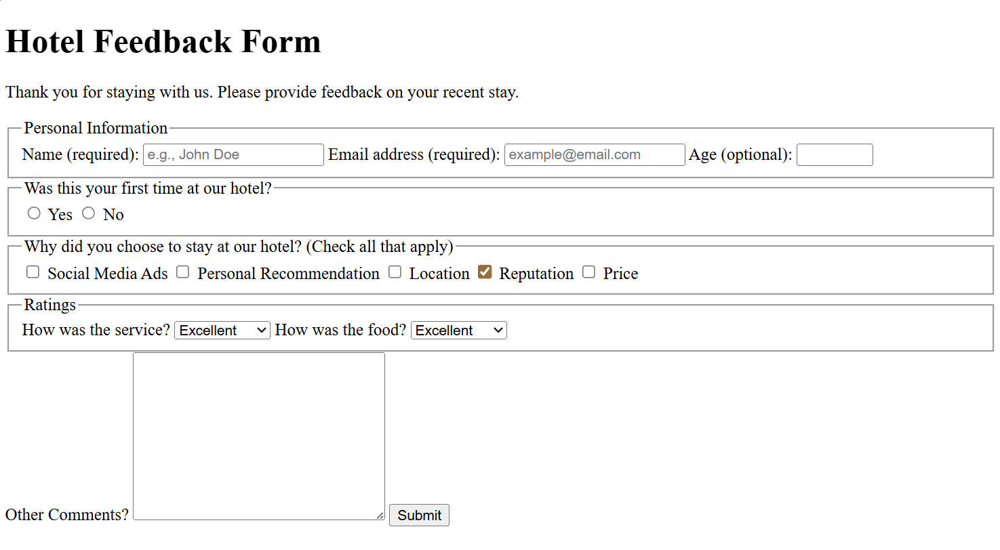

# BUILD A HOTEL FEEDBACK FORM

## MAKING USE OF THE FOLLOWING TAGS ;

***
 ## FORM :
  * To enter a collection of fieldsets
***

***
 ## FIELDSET :
  * To enter a collection of inputs
***

***
 ## LEGEND :
  * Enter the fieldset title
***

***
 ## INPUT :
  * Creante an input
***

***
 ## LABEL :
  * Enter a text beside the input
***

## PLACEHOLDER :
 * Enter a text in the input

***

## FOR : 
 * Link the value of the input and the label

***

## Type : 
 * To precise the type of input
 *  Ex : chechbox, number, text etc ..

*** 

## CKECKED : 
 * To make the input feel as it has been cheched

## TEXTAREA : 
 * To create an area to insert a text
## Textarea contains 
 * COLS, it specifies length of the column

## ROWS : 
 * Specifies the length of the row.

## name : 
 * Name specifies the name of the textarea

## OPTION : 
 * Used to enumerate the elements of the selection list

## SELECT :
 * Used to create a selection list 

### THE CODESPACE

***
 
***

### THE RESULT 

***
 
***